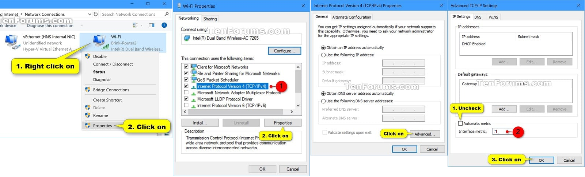

# scc-lan-restore
Restores LAN mode on Splinter Cell Conviction after servers shutdown.

# UPDATES

- 03/01/2024: v2 includes important fixes for "Unable to Join the Match. The connection is not responding", please update script.
- 05/01/2024: added [windows executable](https://github.com/Ododo/scc-lan-restore/releases/) as alternative to installing python.

# Current Status
[NEED TESTING]

1. ByPassed LAN menu blocked with error message "The Splinter Cell Conviction server is not available at this time, please try again later." [**OK**]

2. Able to discover and host Lan sessions [**OK**]

3. Able to Join a session [**OK**]

4. Play the Game [**OK**]  
The fix appears to work for most people.

5. Out-of-sync or remote client disconnected issues.  
This is an issue not related to the lan restore fix, but i'm doing some investigations nevertheless.
The problematic code was identified but not fully understood, i will maybe write somewhere what i collected
so far.  
Legend says it is related to running AMD Ryzen versus Intel CPUs or older AMD cpus.

# Instructions
Windows 10/11, tested on Windows 10 and 11.
1. Set the preferred network interface used by game. If you don't see other sessions when searching for games, or fail to connect to other sessions, it is likely that the outgoing broadcast packets to search for lan sessions are routed to the wrong interfaces, messing up with the session discovery. You can verify what IP address the game is using by checking the logs printed. (e.g. "Game will likely use IP x.x.x.x" after run script, and "Send packet: game broadcast search packet using x.x.x.x" on searching for sessions in game). 

    To set the network interface priority:
    1. Press `Win + R` keys to open Run, type **ncpa.cpl** and press enter to open Network Connections.
    2. Right click on the network adapter (e.g.: "Radmin VPN") you want to change the priority for, and click **Properties**. This usually is the virtual interface created by your "VPN" system like Radmin VPN to play with remote players, or the physical interface like "Ethernet x" if you are playing on physical LAN network.
    3. Select **Internet Protocol Version 4 (TCP/IPv4)**, and click **Properties**.
    4. Click **Advanced**.
    5. Uncheck the **Automatic metric** box, enter **1** in **Interface metric**, the smaller the more priority, then click **OK**.
      
       
    
   **Note**: If this does not take effect, you should make sure other interfaces' metric is "automatic" or set to a larger value, it is known that radmin sets its metric to 1. (Or just deactivate all unused network interfaces) 

2. You will need to edit *C:\Windows\System32\drivers\etc\hosts* and add `127.0.0.1 gconnect.ubi.com` at the bottom. Then open powershell and type `ipconfig /flushdns`  

    What it does is that it will tell the game to look for 127.0.0.1 when it is trying to connect to gconnect.ubi.com. We will handle instead the request from the game as 127.0.0.1 is our local machine.

    The game used to request some configuration from gconnect.ubi.com on port 3074, but this service is now on port 80. Serving from localhost is more futureproof as we don't rely on external services.

    This is what actually blocked the LAN menu.

4. The workaround currently relies on a Python script. You can either run it from Python following theses steps below, or run directly as administator the [executable](https://github.com/Ododo/scc-lan-restore/releases/) created with pyinstaller.
   * Install Python3 preferably from [https://www.python.org/](https://www.python.org/downloads/windows/), check "Add Python to PATH", select "Customize installation" and check "[pip](https://pip.pypa.io/en/stable/installation/)".
   * Install pip package pydivert `pip install pydivert` or `python -m pip install pydivert`
   * Download scc_lan_helper.py from this repository.
   * Then open Windows terminal or powershell *as administrator*, and run the service with
     `python scc_lan_helper.py` and that's it..
   **You will need to keep the program window open while playing the game.**

# What does the python script do and why do i need to run as administrator
  The administrator priviliedges are required because the script relies on hooking some inbound UDP packets used by the game and modifying them before they are handled by the game.
  There are 2 parts: a socket server listening on port 3074 and answering the game HTTP requests.
  The hook part which aims to fix the UDP discovery reply sent by the game host telling "i'm currently hosting a game, and those are the infos to connect". It will edit the packets so that your game client will be able to join.

# Test results, troubleshooting
General protection faults on Windows 10, possible solutions:
- Install [Virtual Audio Cable](https://vb-audio.com/Cable/) (reported working on https://github.com/Ododo/scc-lan-restore/issues/2)
- Plug in both microphone and headphones
- Try this guide: https://steamcommunity.com/sharedfiles/filedetails/?id=271381800
- Use legal copy of the game (Steam, ubisoft,...)
- Upgrade to Windows 11

Please open issues here, thanks.
