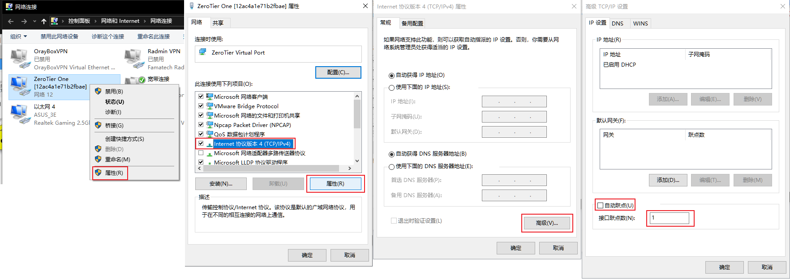

# 细胞分裂5局域网修复工具

[README](README.md) | [中文文档](README_zh.md)

修复《细胞分裂：断罪》在服务器关闭后的局域网联机模式。

# 更新

- 2025/09/01：v3 更新了说明和脚本，加入和搜索房间更稳定。还添加了详细日志（支持中文）用于排除故障。请更新脚本。
- 2024/03/01：v2 包含了“无法加入比赛。连接没有响应”的重要修复，请更新脚本。
- 2024/05/01：添加了[Windows 可执行文件](https://github.com/Ododo/scc-lan-restore/releases/)，作为安装 Python 的替代方案。

# 当前状态
[需要测试]

1. 绕过打开局域网菜单时报错“目前无法使用细胞分裂：断罪服务器，请稍后再试”。[**OK**]

2. 能够搜索和创建局域网房间 [**OK**]

3. 能够加入房间 [**OK**]

4. 游戏正常运行 [**OK**]  
修复对大多数人有效。

5. 同步问题或远程客户端断开连接问题。  
这个问题与局域网修复无关，但我仍在进行一些调查。问题代码已被识别但尚未完全理解，我可能会在某处写下我收集到的信息。  
似乎这与运行 AMD Ryzen 与 Intel CPU 或旧的 AMD CPU 有关。

# 使用说明
Windows 10/11，已在 Windows 10 和 11 上测试。
1. 设置游戏首选的网卡。如果在搜索游戏时看不到其他房间，可能是搜索数据包从错误的网卡发出，导致找不到其他房间。你可以检查打印的日志，确认游戏是否使用了正确的 IP 地址。（例如，运行脚本后会显示“预计游戏将使用IP: x.x.x.x”，或在游戏中搜索房间时脚本会显示“发送数据包：游戏从 x.x.x.x 广播发出房间搜索数据包”）。

    设置网卡优先级（如下图所示）：
    1. 按 `Win + R` 键打开运行，输入 **ncpa.cpl** 并按回车，打开网络连接（更改适配器选项）。
    2. 右键单击要更改优先级的网络适配器（例如：“Radmin VPN”）。如果与外网朋友一起玩，一般应该选择由虚拟局域网程序建立的虚拟网卡（如 Radmin VPN、Zerotier、蒲公英等），如果是物理局域网，选择物理网卡（如“以太网 x”）。然后单击 **属性**。
    3. 选择 **Internet 协议版本 4 (TCP/IPv4)**，然后单击 **属性**。
    4. 单击 **高级**。
    5. 取消勾选 **自动跃点** 框，在 **接口跃点数** 中输入 **1**，数值越小优先级越高，然后单击 **确定**。
      
       
    
   **注意**：如果不起作用，确保其他网口的跃点数勾选了“自动”或设置为更大的值，已知 Radmin 会将自动将其跃点数设置为 1。（也可以直接禁用所有不用的网卡）

2. 编辑 *C:\Windows\System32\drivers\etc\hosts* 并在底部添加 `127.0.0.1 gconnect.ubi.com`。然后打开 powershell 并输入 `ipconfig /flushdns`。

    这样做是为了告诉游戏在尝试连接到 gconnect.ubi.com 时查找 127.0.0.1。我们将处理来自游戏的请求，因为 127.0.0.1 是我们的本地机器。

    游戏以前会从 gconnect.ubi.com 的 3074 端口上请求一些配置，但现在该服务在 80 端口上。改为从本地主机提供服务更保险，因为不需要依赖外部服务。

    这是导致无法打开局域网菜单的原因。

3. 当前的解决方法依赖于 Python 脚本。您可以按照以下步骤从 Python 运行它，或者直接以管理员身份运行使用 pyinstaller 创建的[可执行文件](https://github.com/Ododo/scc-lan-restore/releases/)。
   * 最好从 [https://www.python.org/](https://www.python.org/downloads/windows/) 安装 Python3，勾选“Add Python to PATH”，选择“Customize installation”并勾选“[pip](https://pip.pypa.io/en/stable/installation/)”。
   * 安装 pip 包 pydivert `pip install pydivert` 或 `python -m pip install pydivert`
   * 从此仓库下载 scc_lan_helper.py。
   * 然后以管理员身份打开 Windows 终端或 powershell，并运行
     `python scc_lan_helper.py` 就可以了。
   
   **在玩游戏时请保持程序窗口打开。** 不过该运行程序可以随时运行，无需重启游戏，所有更改都即时生效。

# Python 脚本的作用及为何需要以管理员身份运行
  需要管理员权限是因为脚本会hook游戏使用的一些入站 UDP 数据包，并在它们被游戏处理之前修改它们。

  有两部分：1）一个在端口 3074 上监听并回答游戏 HTTP 请求的套接字服务器。2）hook部分，可以修复房主发送的 UDP 回复，其中包含房主的连接信息。本工具会编辑数据包，以便客户端能够加入。

  运行脚本时，会打印一些有用的日志以帮助调试。例如，如果无法找到或加入其他房间，请检查你和朋友的游戏使用的 IP 地址是否互相均可达。（通常同一子网的 IP，如 192.168.1.x 互相可达。如果想详细了解，可以搜索“路由表”。）

# 测试结果，故障排除
Windows 10 上的常规保护故障，可能的解决方案：
- 安装 [Virtual Audio Cable](https://vb-audio.com/Cable/)（在 https://github.com/Ododo/scc-lan-restore/issues/2 上报告有效）
- 插入麦克风和耳机
- 尝试此指南：https://steamcommunity.com/sharedfiles/filedetails/?id=271381800
- 使用正版游戏（Steam，Ubisoft，...）
- 升级到 Windows 11

# 已知问题

使用该脚本会导致出站广播数据包被复制多次，因此游戏中可能会出现多个房间，选择其中任意一个即可。

请在此处提交Issue，谢谢。

# 给爱捣鼓的人看的详细说明

游戏的工作原理：
1. 主机创建房间
2. 客户端发送搜索数据包：发送 UDP 广播数据包到 255.255.255.255:46000，载荷长度 == 54
3. 主机回复房间信息数据包：发送 UDP 广播数据包到 255.255.255.255:46000，载荷长度 > 500，其中（正常情况下）包含主机的 IP 和 MAC 地址。
4. 客户端使用主机信息数据包中的 IP信息，尝试直接与主机通信（两台机器上的 UDP 9103 端口）。

可能出现的问题：
1. 如果启用了多个网卡，数据包可能从错误的接口发送。
   
   这将导致数据包无法到达另一台机器，导致客户端无法找到主机房间。

   游戏使用到 255.255.255.255 的路由跃点最小的接口发送数据包，可以通过在 cmd / powershell 中运行 `route print` 查看路由表。找到 *网络地址* 为 255.255.255.255 的行，如果跃点（最后一列）最小，就会使用该行对应的接口。对路由表所做的任何更改（如使用说明部分的步骤 1）会立即生效，无需重新启动游戏或本工具。

2. 房间信息数据包中的主机 IP 信息错误。
   
   房间信息数据包载荷中的 IP 字段是可变长度的，其可能包含主机电脑上所有启用的网卡的 IP 地址。有时由于未知原因，IP 字段为空。两种情况都会导致问题，在第一种情况下，客户端可能会尝试连接错误的 IP 地址，在第二种情况下，客户端不知道如何连接主机。这就会导致即使客户端可以看到主机房间（即客户端可以接收到主机的数据包），但无法连接（即数据包载荷中提供的信息错误）。

   为了解决这个问题，我们直接读取接收到的数据包的真实 IP（一定是正确的，否则不可能接收到），并直接用这个 IP 替换数据包中的 IP 字段（无论其为空或是有多个）。
